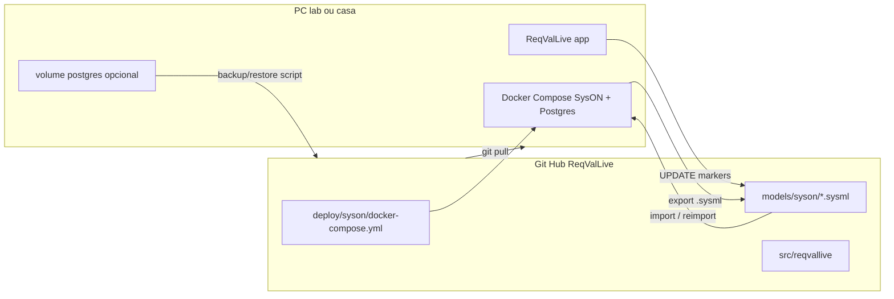

# Plano: SysON como host do modelo (sem TWC/Cassandra)

## Respostas diretas

**Nova janela de agente:** Sim, faz sentido. Eu não consigo “abrir outra janela” por ti de forma fiável; o fluxo limpo é: após aprovares este plano, abres um **New Agent**, anexas este plano / a pasta `ReqValLive`, e continuamos lá. Nesta conversa posso só **renomear o chat** (ex.: `SysON bridge`) para achares depois. O código e o Git é que preservam o progresso — não o histórico do chat.

**Novo repositório?** Válido, mas **não recomendado agora**. O núcleo MQTT/GSE/gate/UPDATE já está em [ReqValLive](ReqValLive/). Um segundo repo fragmenta clones lab/casa e duplica adaptadores. **Decisão do plano:** continuar no **mesmo** [ReqValLive](ReqValLive/) com `deploy/syson/` + pacote `reqvallive.syson`. Novo repo só faria sentido mais tarde se quiseres um deliverable “só SysON” separado da dissertação.

**Mesmo Docker lab e casa sem perder progresso?** Sim — a vantagem sem licença/VPN é exatamente essa:




- **Fonte de verdade portátil:** modelos em `models/syson/*.sysml` **commitados** (ou exportados antes de sair do lab).
- **Stack idêntica:** o mesmo `docker-compose.yml` no Git → `docker compose up` em qualquer PC com Docker.
- **BD:** volume nomeado + scripts `backup`/`restore` para não perder projetos UI entre máquinas; se o volume falhar, **reimportas o `.sysml` do Git**.
- Não precisas de “um Docker partilhado na rede”: precisas do **mesmo compose + mesmos ficheiros** via Git (sem VPN Dassault).

## Arquitetura alvo

```text
SysON (localhost:8080)  --.sysml / REST parcial / GraphQL-->  ReqValLive
                                                              gate → GSE → MQTT
                                                              → UPDATE markers
                                                              → reimport / patch no SysON
```

- **SysON** = autoridade do modelo no PoC (alinhado com o Christopher; sem Collaborate/Cassandra).
- **ReqValLive** = evidência live (inalterado no núcleo).
- **TWC/CATIA** = paralelo documentado; sem bloqueio de desenvolvimento.

## Fases de implementação (no ReqValLive)

### 1. Deploy SysON versionado

- Pasta `[ReqValLive/deploy/syson/](ReqValLive/deploy/syson/)`: `docker-compose.yml` (imagem `eclipsesyson/syson`, Postgres), `.env.example`, README curto (lab/casa).
- Scripts PowerShell: `up.ps1`, `down.ps1`, `backup-db.ps1`, `restore-db.ps1`.
- Doc: [local_test](https://doc.mbse-syson.org/syson/v2025.6.0/installation-guide/how-tos/install/local_test.html) — perfil single-user (sem auth pesada).

### 2. Modelo demo portátil

- `models/syson/reqvallive_demo.sysml` com `RQ_BAT_001` + `_go_to_verification` + SC JSON (mesmo contrato do parser atual em `[import_catia.py](ReqValLive/src/reqvallive/sysml/import_catia.py)`).
- Checklist manual: import no SysON UI → confirmar requirement/doc.

### 3. Cliente SysON (espelho leve do TWC)

- Novo pacote `src/reqvallive/syson/` (probe health, list projects/elements via `/api/rest/`, settings em `[config.py](ReqValLive/src/reqvallive/config.py)`: `SYSON_BASE_URL=http://localhost:8080`).
- Script `scripts/probe_syson.py`.
- Spike UPDATE (ordem de preferência fixa):
  1. **Patch `.sysml` + reimport/upload** (caminho documentado como estável na v2025.6.0),
  2. Se o spike REST/GraphQL (`insertTextualSysMLv2` / POST commits) for fiável na imagem escolhida, usar isso no mesmo adaptador.
- Reutilizar o payload de `[catia_update.py](ReqValLive/src/reqvallive/reports/catia_update.py)` (`_verification_PASS/FAIL` + evidence) — só muda o *publisher*.

### 4. API/UI mínima

- `POST /api/syson/probe` e `POST /api/syson/publish-update` (sessão medida → markers → SysON).
- Botão na UI existente “Publicar UPDATE no SysON” (não TWC).

### 5. Docs / dissertação

- Atualizar `[docs/syson_v2025.6.0/README_DECISAO.md](ReqValLive/docs/syson_v2025.6.0/README_DECISAO.md)` e `[LEMBRETE_TWC_REST_EVOLUCAO.md](ReqValLive/docs/LEMBRETE_TWC_REST_EVOLUCAO.md)`: SysON = caminho principal; TWC = bloqueado por Cassandra sem admin.
- Nota: vantagem = sem licença Magic Collaborate e sem VPN para fechar o ciclo no PC.

## Fora de escopo (agora)

- Corrigir Cassandra / criar projeto novo no TWC.
- Novo repositório GitHub.
- MCP / dump JSON completo do modelo.

## Como trabalhar limpo no Cursor

1. Aprovar este plano.
2. **New Agent** → anexar o plano + abrir workspace `ReqValLive`.
3. Executar Fase 1 (Docker up) no lab ou em casa — o que tiver Docker primeiro.

